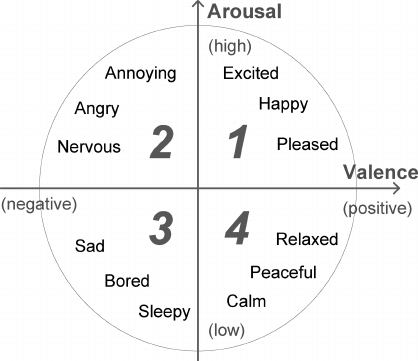

# **EmoEye team Final Project page for Deep Learning course**
This repository contains the code for the final project course on deep learning, which aims to build a multimodal architecture for emotion prediction problem. The goal of this project is to build and fine-tune multimodal neural network for prediction of Emotions based on Eye-Tracking and biometric data. The dataset itself is private, but preprocessed data will be available for some time [here](https://drive.google.com/drive/folders/13PBjyQtvs1utcz7AYh7pn1dX7-7vFCRM?usp=sharing).

# **Dataset**
We used private dataset containing 29,153 5-second reactions from 160 participants to 799 Images. Images are very diverse and contain scenes, people, animals, etc.
After 5 seconds of Image presentation, participants reported the percieved emotion on Arousal (from 1 to 7, from boring to exciting) and Valence (from 1 to 7, from negative to positive) scales.

During 5 seconds of Image presentation the following data were collected:
1. The eye-tracking data - X, Y coordinates on the picture at which participant was looking at
2. The pupillometry data - sizes of the pupils
3. Heart Rate (HR)
4. Galvanic Skin Response (GSR)

Note, classes of target variables - arousal (1-7) and valence (1-7) - are highly imbalanced and correlated.

## **Project presentation**
#### [Final project presentation](https://docs.google.com/presentation/d/1gR8r-b8pp3k-3rXXY29RrGX3uN2F91EH/edit?usp=sharing&ouid=104806623978954596637&rtpof=true&sd=true)

# **General Project Goals**
X and Y coordinates of eye-tracking data may be naturally represented as an image of scanpath that may be analyzed via Convolutional Neural Network (CNN). At the same time we still have some additional time-series biometric data (pupil size, GSR, HR) that may be analyzed via Recurrent Neural Network (RNN). So, a natual idea is to implement CNN and RNN at once in multimodal neural network by concatenatination of CNN and RNN outputs (this approach is described in [this](https://dl.acm.org/doi/10.1145/3382507.3418828) article[^1]). We implemented this approach on our private dataset and improved it by adding extra module processing the Image shown to the participant.
[^1]: Sims, S. D., & Conati, C. (2020). A Neural Architecture for Detecting User Confusion in Eye-tracking Data. 
Proceedings of the 2020 International Conference on Multimodal Interaction. doi:10.1145/3382507.3418828.

# **Implemented tricks for training procedure**
1. Focal loss (gamma=3) - we saw this problem as classification problem not regression, and focal loss greatly improved performance. We also set balanced class weights into CrossEntropyLoss.
2. Dataset balancibg - it's close to impossible to balance dataset for both arousal and valence classes, we aplied some heuristics to create subset of data with close uniform class distribution.
3. Train-test split - we suspected some overfitting from VGG16 so for testing we used set of 100 Images that network didn't see completely during training and all 5-seconds reactions to them.

# **Methods**
Resulting multimodal network consists of three parts:
1. CNN-LSTM to analyze time seies data (X, Y, pupil size, GSR, HR)
2. CNN to analyze scanpaths
3. VGG16 to analyze Images (visual stimuli)

During training, only top layers of VGG16 were unfrozen.

# **Repository structure**
1. Notebook `Multimodal_network` - notebook with dataloaders, train-test loops and implemented in pytorch multimodal network
2. Notebook `Separated_networks` - notebook with dataloaders, train-test loops and implemented in pytorch parts of multimodal network
3. Notebook `Augmentation` - notebook to augment Images and Eye-tracking data at once. We didn't have time to train with augmentations, but it works!

# **How to Use**
1. Download data [here](https://drive.google.com/drive/folders/13PBjyQtvs1utcz7AYh7pn1dX7-7vFCRM?usp=sharing)
4. Run notebooks. Each notebook may be treated separately

# **Data Structure**
Data contains `prep_data\epochs` folder with 5-seconds csv files and `Images` folder with visual stimuli:
* In `prep_data\epochs` in each folder (`0`, `1`, `2`, … etc.) there are csv files corresponding to eye-trackings and biometric data from a participant. For example, `0_dog 7_4_6.csv` is a response to the first picture in the session, `dog 7.jpg`, and participant reported `4` on arousal and `6` on valence scales.
In `csv` files there are following columns:
* `TIME` - time in sec from the beginning of the recording 
* `FPOGX`, `FPOGY` - Fixation Point-Of-Gaze (X, Y coordinates, from 0 to 1 with outliers if person looks outside of the screen) 
* `FPOGID` - index of the fixation point 
* `FPOGV` - is `FPOG` valid? In times at which eyes were not detected - this column has zeros 
* `LPMM`, `RPMM` - left and right eye pupil diameter in millimeters 
* `LPMMV`, `RPMMV` - is `LPMM`/`RPMM` valid? 
* `GSR` - Galvanic Skin Response 
* `GSRV` - is GSR valid? 
* `HR` - Heart Rate (BMP) 
* `HRV` - is `HR` valid? 
* `Image` - image shown 
* `Arousal`, `Valence` - response of the participants

# **Results**
Using multimodal upproach we got average accuracy on the test set equal to 61% on arousal and 48% on valence scales with very reasonable confusion matrices.

Each separate module of the multimodal architecture performed worse with VGG16 having the lowest accuracies. 

# **Conclusions**
From [this](https://ieeexplore.ieee.org/document/9337074/) review[^2], we found that usually people classify 3 classes of emotions (negative, neutral, positive) and get accuracy in 53-88% range. We used more classes (7) and classified on two scales (arousal-valence) at once and got comparable accuracy. Our private dataset is very raw and we are the first people who analyzed this data and created ML/DL model with it, and we didn't know what to expect at all. With our models we proved that this dataset contains some meaningful data and may be used for future investigations.
[^2]: Gill, R., & Singh, J. (2020). A Review of Neuromarketing Techniques and Emotion Analysis Classifiers for Visual-Emotion Mining. 2020 9th International Conference System Modeling and Advancement in Research Trends (SMART). doi:10.1109/SMART50582.2020.9337074

# **EmoEye Team**
* Pavel Tikhonov - data augmentation techniques, transformer testing
* Ivan Kudryakov - hyperparameters search
* Marina Morozova - dataset preparation, general idea of architecture
* Marco Offidani - presentation, finalization of the report
* Ziang Guo - hyperparameters search, testing modules separately

# **Thanks!**

